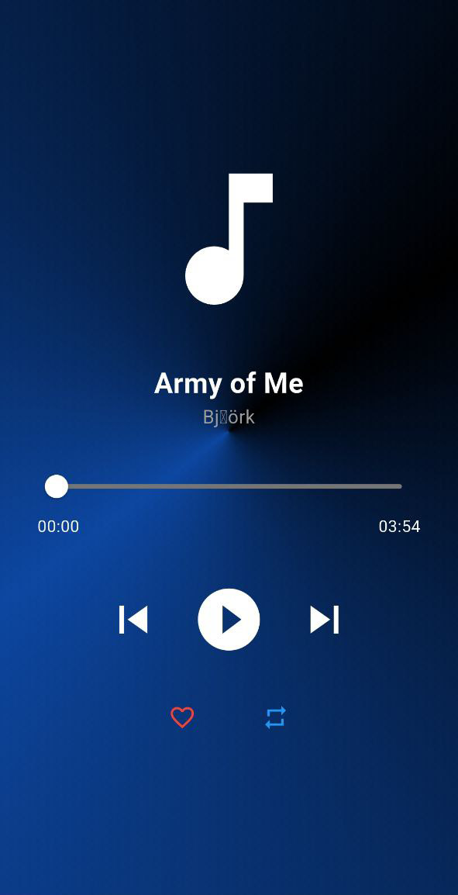
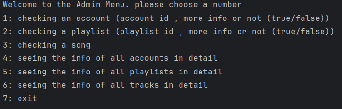

# AP_Music_player_project

A project for the subject **Advanced Programming** about a music player called **"Navak"**
create as many accounts as you wish, add as many tracks as you desire and organize them into as many playlists as you like and vibe till there is no tomorrows left!

---

## ✨Features✨:

### 🗣️An account based app🗣️:
Create as many accounts as you wish! All it takes is your email/phone number, a password of your own choice and a username of your own choice as well!  
Once done, you are good to go and will be moved into the library.


---

### 📖A tab based library📖:
Add any song from your phone into the app and create playlists. If you really like some songs why not like them to transport them to the *"liked tab"*?  
Enjoy listening to music :D


---
<br/>
<br/>
### ⚙️Fairly customizable settings⚙️:
Did you forget your password? Did you by any chance want to isolate yourself from people so that they don't send you their stupid songs? Fear not as the **_Settings page_** will get this done. Enter your new account name/password/email/phone to change your information and in case you want to be a private person, just check the checkbox below so people stop sending you their songs.


---

### ✨🎵🎵Vibe🎵🎵✨:
just enjoy the Vibe




---
<br/>
<br/>

### 👨‍💻Admin page👩‍💻:
unleash your inner admin in this terminal based admin page and look see the full details of one account/playlist or track or see the information of every singe account in one or two simple inputs.




---

## ❗❗Requirements❗❗:
- The latest version of [flutter](https://flutter.dev/)
- An IDE that can build apps for phone such as android studio
- An android phone (yes we are those types of devs that make apps exclusive to one platform :P)

> [!NOTE]
> in case no tracks or playlists were showing up, keep on refreshing or in worst-case scenario, close and reopen the app and wait for a while.

---

## ❗❗❗How to get the app working❗❗❗:

1. Clone the repository.
2. Create a new config for the backend part.  
   Within *Edit Configurations*, in the VM options add the command below:
   ```
   --add-opens java.base/java.time=ALL-UNNAMED
   ```
   -make sure to run ServerSocket in order to connect the mobile device with the computer.
3. In case you don't know your IP address, type the command below you into CMD:
   ```
   ipconfig
   ```
   -make sure you have the [Gson](https://mvnrepository.com/artifact/com.google.code.gson/gson) package installed somehwhere in your computer and add it in the project settings within an code editor like IDEA
   and copy the IPv4 attribute and paste it everywhere that has a socket within main.dart.
5. Enjoy the show


--- 
## Credits:

The creators of [Java](https://www.oracle.com/java/technologies/downloads/), [Flutter](https://flutter.dev/) and dart.

Iman Tat hesari: project's lord and savior, He can smell colors. if you see any flutter code that actually is good it is because he probably wrote it. he traded his sanity to revamp the backend code, write the entire Song loading system into the app and wrote fingerprint system. he saved the project from never making into the finish line more than once. 

Mohammadamin "Bamdad" Rashidi: Jack-of-all-trades, on a crack called enthusiasm. the person who did most of the planning and direction, co-conceptualized the appreance of the app, wrote the entire backend before the revamp, designed the logo and the background images, and made the sharing and playlist systems.

Our good friends and families for emotional support.

Our mentors:
Navid raeiszadeh, Mohsen karbalaie, Amirhossein ghafarian, Reyhaneh dadashpoor and the other mentors.
and let us not forget Doctor Sadegh aliakbari for his beneficial teaching.

<small>no credits are given to gradle that thing is a pain in one's eyeball <small/>
